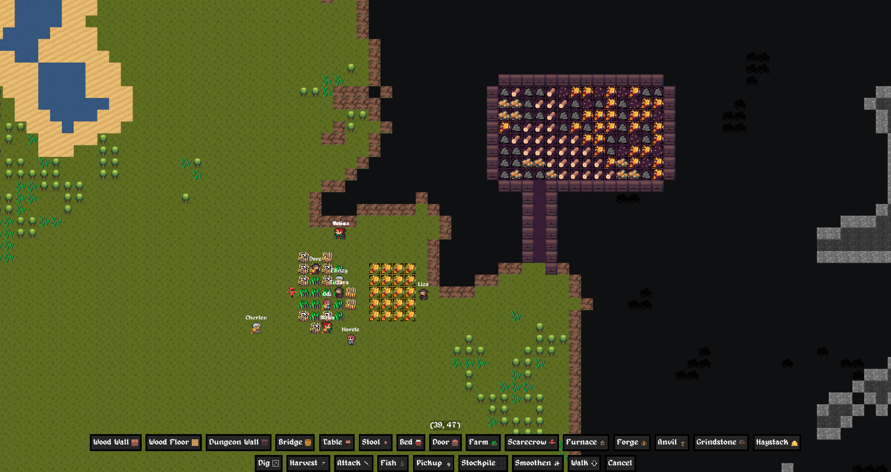
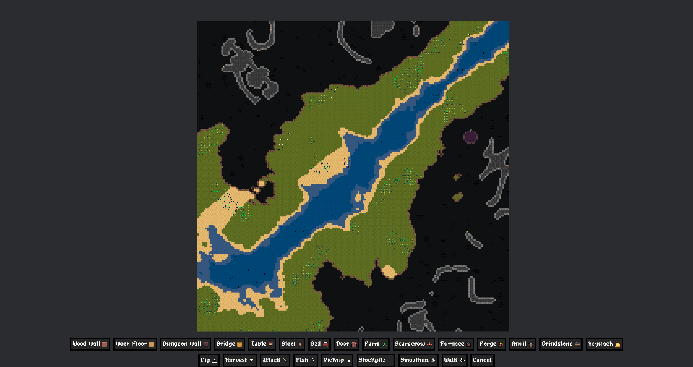

# Dwellers

Dig the mountains, build a settlement for your dwellers, statisfy their needs and conquer the procedurally generated world in this Dwarf Fortress / RimWorld inspired game.

This game aims to be a casual alternative to DF or RW, with simpler mechanics.

## Features

- Tile-based 2D world, infinite and chunk-based, procedurally generated with mountains, rivers, forests, deserts, plains, caves and structures
- Dwellers, with basic needs
- Task system: dig, build, eat, sleep, etc.
- Basic AI for auto pathfinding and task management
- Monsters and animals
- Simple systems with emergent interactions
- Save and load worlds

## Gameplay

- Explore the world and find a good place to settle
- Carve out a home in the mountains
- Build a settlement with rooms and storage
- Mine ore, explore caves
- Smelt ore, craft armor and swords
- Build farms, cook bread
- Chop down trees, build furnitures
- Fish, hunt animals
- Keep an eye on your dwellers' food and sleep needs

## Showcase

## Note

This is very WIP, but somewhat playable. Give it a try and let me know what you think!

## Contributing

If you want to contribute, feel free to open an issue or a pull request. I am open to suggestions and feedback.
